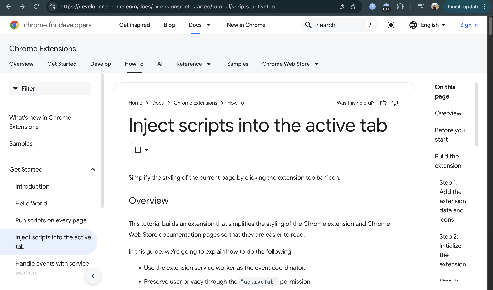
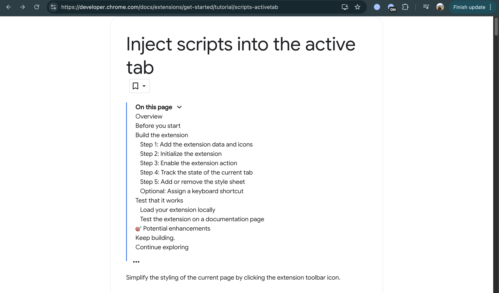

# Project 2 : Focus Mode

## Overview

Chrome extension to simplify the styling of Chrome’s official Extensions and Chrome Web Store documentation pages. It helps make the content easier to read by hiding distractions and centering the main article.

## Features

- Hides non-essential elements like navigation bars and sidebars.
- Centers and cleans up the layout of documentation pages.
- Can be toggled on/off via toolbar icon or keyboard shortcut.
- Uses the `activeTab` permission to preserve user privacy.

## How to Test

1. **Install the extension** in Chrome:

   - Go to `chrome://extensions/`
   - Enable **Developer mode**
   - Click **Load unpacked** and select your project folder

2. Visit a documentation page such as:

   - [https://developer.chrome.com/docs/extensions](https://developer.chrome.com/docs/extensions)
   - [https://developer.chrome.com/docs/webstore](https://developer.chrome.com/docs/webstore)

3. Click the **extension toolbar icon** or press **Ctrl + B (Cmd + B on Mac)** to toggle focus mode.

4. You should see the **page layout change**:

   - From this:

   

   - To this:

   
